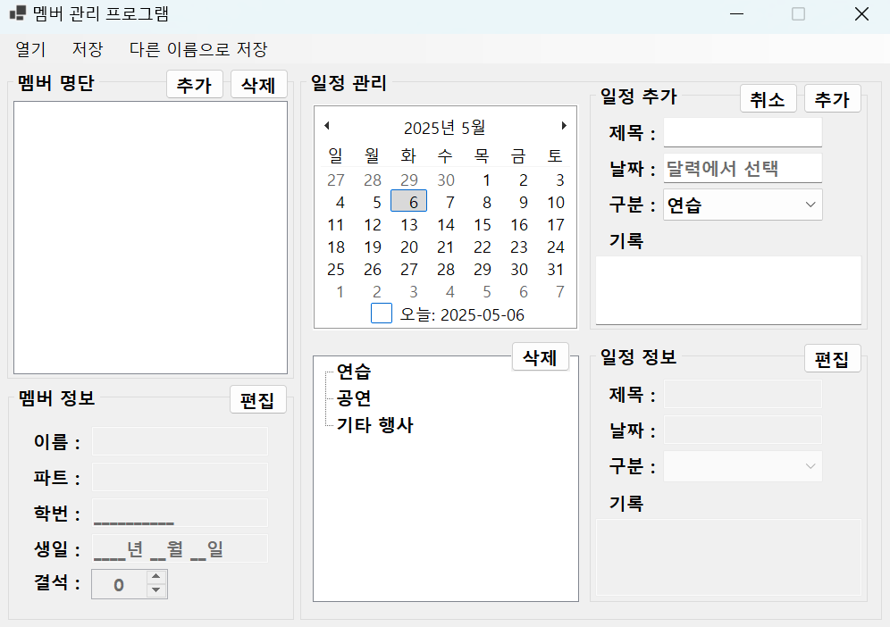
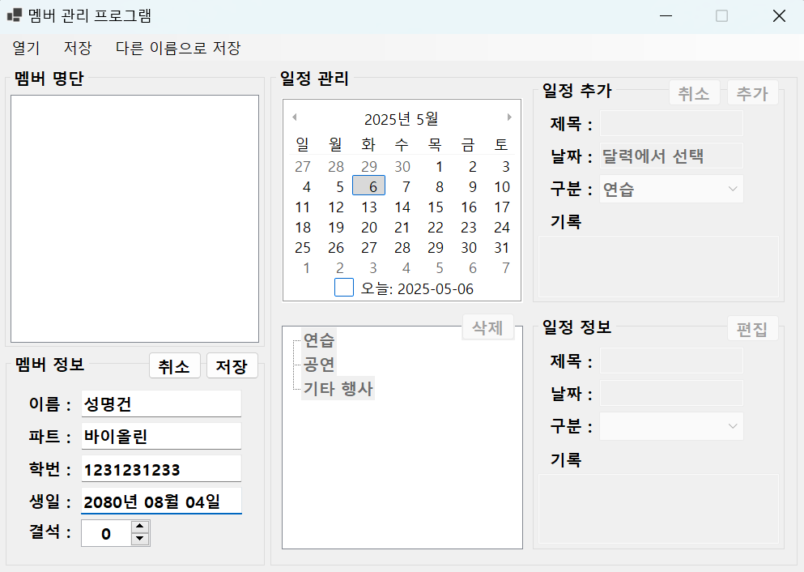
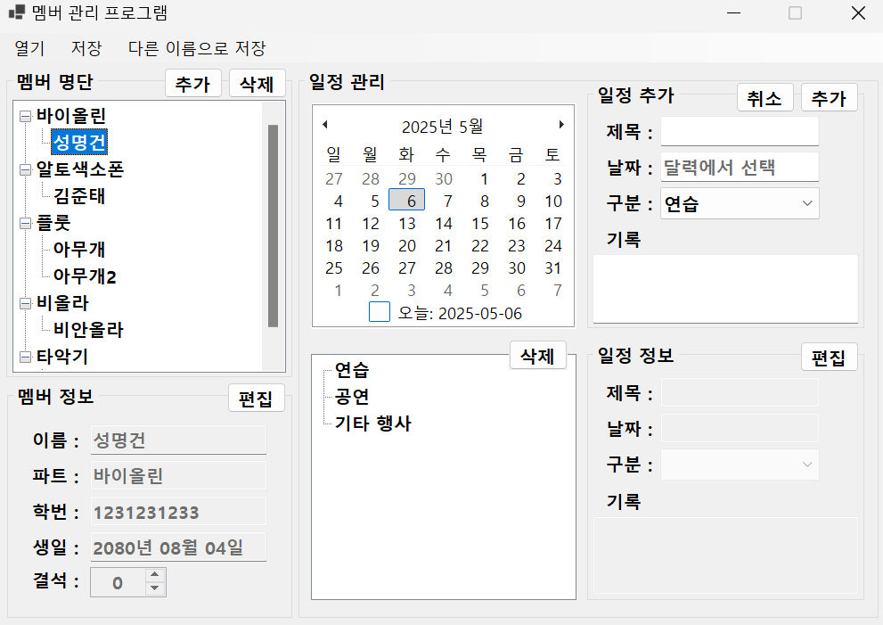
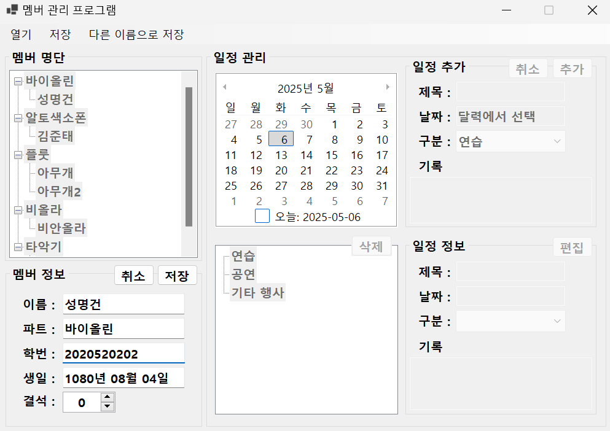
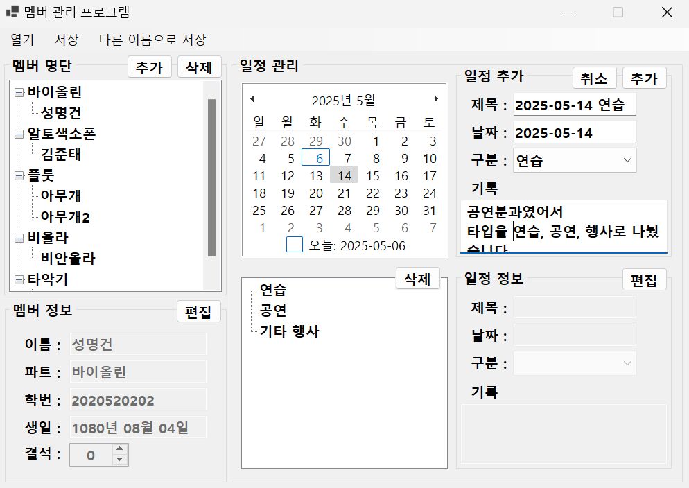
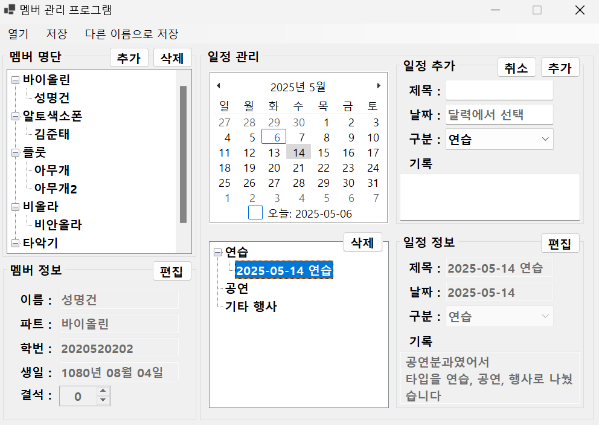
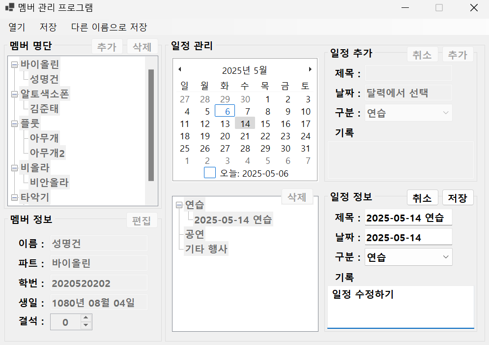
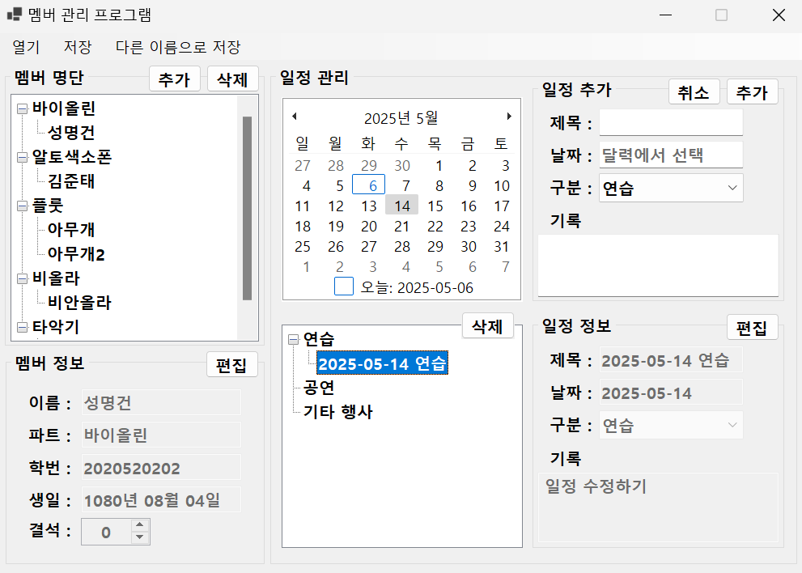

# WinFormProject
WinFormProject 동아리 관리 프로그램

## 선정 이유
- 대학교 동아리(공연분과였음) 활동 당시에 동아리를 관리하던 운영부서 친구들을 떠올리며, '이런 프로그램이 있었다면 편하지 않았을까?' 하는 생각에 선정하였음

## 지원 기능
- 멤버 추가, 편집, 삭제
- 일정 추가, 편집, 삭제

## 캡처 화면
- 최초 화면

- 멤버 추가

  
- 멤버 정보 편집

  
- 일정 추가

- 일정 정보 편집

## 추가하고 싶은 기능
- 파일로 저장 / 불러오기
- 명단 이름 순으로 정렬
- 일정이 있는 날은 달력에 표시
- 멤버 결석 `날짜`를 기록
- 일정 월 별로 분류
- 동명이인, 동일한 제목의 일정에 대한 처리
